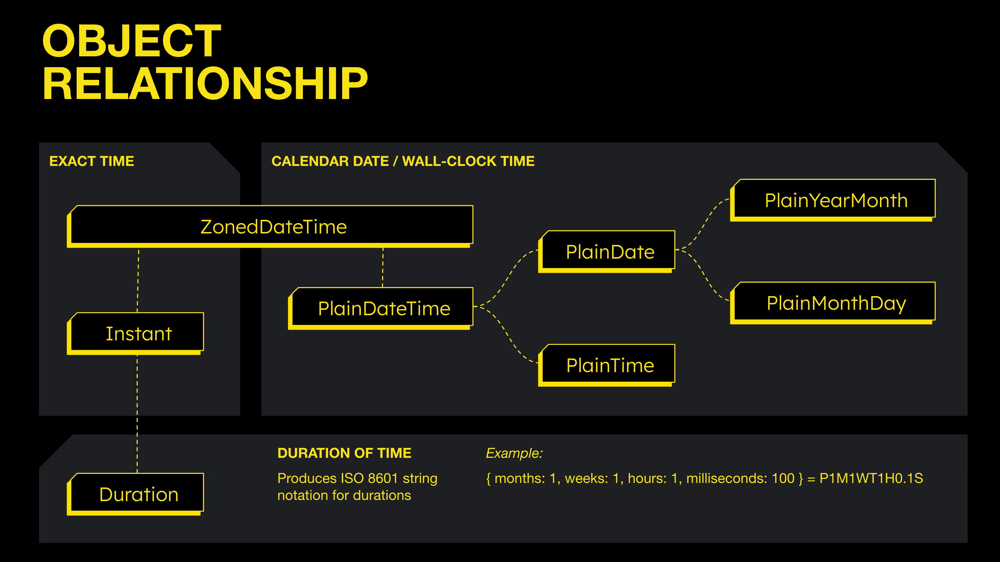

# It's About Time...
## JavaScript Temporal API
A talk by [Rimas Krivickas](https://www.linkedin.com/in/rimaskrivickas/).

* Watch the presentation on [YouTube](https://youtu.be/MzhKKB8Z61k).
* Explore code used in the presentation on [GitHub](https://github.com/rimas-talks/its-about-time).
* Check the current status of the [proposal](https://tc39.es/proposal-temporal/).


### New Building Blocks


#### Temporal.Now
Precise, time zone–aware access to the current date and time.
* Documentation: [TC39](https://tc39.es/proposal-temporal/docs/now.html), [MDN](https://developer.mozilla.org/en-US/docs/Web/JavaScript/Reference/Global_Objects/Temporal/Now)

###### _Examples:_

```js
  // Get the current system exact time
  Temporal.Now.instant();

  // Get the current system time zone
  Temporal.Now.timeZoneId();

  // Get the current date and wall-clock time in the system time zone and ISO-8601 calendar
  Temporal.Now.zonedDateTimeISO();

  // Get the current date in the system time zone and ISO-8601 calendar
  Temporal.Now.plainDateISO();

  // Get the current wall-clock time in the system time zone and ISO-8601 calendar
  Temporal.Now.plainTimeISO();

  // Same as above, but return the DateTime in the ISO-8601 calendar
  Temporal.Now.plainDateTimeISO();
```


#### Temporal.Instant
Precise and immutable point in time on the global timeline.
* Documentation: [TC39](https://tc39.es/proposal-temporal/docs/instant.html), [MDN](https://developer.mozilla.org/en-US/docs/Web/JavaScript/Reference/Global_Objects/Temporal/Instant)

###### _Examples:_

```js
const instant = Temporal.Instant.from('1969-07-20T20:17Z');
console.log(instant.toString()); // '1969-07-20T20:17:00Z'
console.log(instant.epochMilliseconds); // -14182980000
```


#### Temporal.ZonedDateTime
Specific moment in time together with a time zone and calendar.
* Documentation: [TC39](https://tc39.es/proposal-temporal/docs/zoneddatetime.html), [MDN](https://developer.mozilla.org/en-US/docs/Web/JavaScript/Reference/Global_Objects/Temporal/ZonedDateTime)

###### _Examples:_

```js
const inBerlin = Temporal.ZonedDateTime.from('2022-01-28T19:53+01:00[Europe/Berlin]');
const inTokyo = inBerlin.withTimeZone('Asia/Tokyo');
console.log(inBerlin.toString()); // 2022-01-28T19:53:00+01:00[Europe/Berlin]
console.log(inTokyo.toString()); // 2022-01-29T03:53:00+09:00[Asia/Tokyo]
```


#### Temporal.PlainDateTime
Calendar date and wall-clock time without time zone or offset information.
* Documentation: [TC39](https://tc39.es/proposal-temporal/docs/plaindatetime.html), [MDN](https://developer.mozilla.org/en-US/docs/Web/JavaScript/Reference/Global_Objects/Temporal/PlainDateTime)

###### _Examples:_

```js
const datetime = new Temporal.PlainDateTime(2020, 3, 14, 13, 37);
console.log(datetime.toString()); // 2020-03-14T13:37:00
```


#### Temporal.PlainDate
Represents a calendar date without any time or time zone.
* Documentation: [TC39](https://tc39.es/proposal-temporal/docs/plaindate.html), [MDN](https://developer.mozilla.org/en-US/docs/Web/JavaScript/Reference/Global_Objects/Temporal/PlainDate)

###### _Examples:_

```js
const date = new Temporal.PlainDate(2020, 3, 14);
console.log(date.toString()); // 2020-03-14
```


#### Temporal.PlainTime
Represents a time of day without any date or time zone.
* Documentation: [TC39](https://tc39.es/proposal-temporal/docs/plaintime.html), [MDN](https://developer.mozilla.org/en-US/docs/Web/JavaScript/Reference/Global_Objects/Temporal/PlainTime)

###### _Examples:_

```js
const time = new Temporal.PlainTime(13, 37);
console.log(time.toString()); // 13:37:00
```


#### Temporal.PlainYearMonth
Represents a specific month in a specific year without a day or time.
* Documentation: [TC39](https://tc39.es/proposal-temporal/docs/plainyearmonth.html), [MDN](https://developer.mozilla.org/en-US/docs/Web/JavaScript/Reference/Global_Objects/Temporal/PlainYearMonth)

###### _Examples:_

```js
const yearMonth = Temporal.PlainYearMonth.from({ year: 2020, month: 10 });
console.log(yearMonth.toString()); // 2020-10
console.log(yearMonth.daysInMonth); // 31
```


#### Temporal.PlainMonthDay
Represents a specific month and day without a year or time.
* Documentation: [TC39](https://tc39.es/proposal-temporal/docs/plainmonthday.html), [MDN](https://developer.mozilla.org/en-US/docs/Web/JavaScript/Reference/Global_Objects/Temporal/PlainMonthDay)

###### _Examples:_

```js
const monthDay = Temporal.PlainMonthDay.from({ month: 7, day: 14 });
console.log(monthDay.toString()); // 07-14

// Apply to a specific year
const date = monthDay.toPlainDate({ year: 2030 });
console.log(date.toString()); // 2030-07-14
console.log(date.dayOfWeek); // 7
```


#### Temporal.Duration
An amount of time such as days, hours, or minutes, etc. rather than a specific point in time.
* Documentation: [TC39](https://tc39.es/proposal-temporal/docs/duration.html), [MDN](https://developer.mozilla.org/en-US/docs/Web/JavaScript/Reference/Global_Objects/Temporal/Duration)
* Duration balancing: [TC39](https://tc39.es/proposal-temporal/docs/balancing.html)

###### _Examples:_

```js
const duration = Temporal.Duration.from({
    hours: 130,
    minutes: 20
});
console.log(duration.total({ unit: 'second' })); // 469200
```


#### Object Relationship Diagram
 * Source: [TC39](https://tc39.es/proposal-temporal/docs/#object-relationship)
 * Also see: [String persistence, parsing, and formatting](https://tc39.es/proposal-temporal/docs/#string-persistence-parsing-and-formatting)




### Nanosecond Precision
Temporal API introduces nanosecond precision to UTC timestamp.

###### _Comparison of available APIs:_

| API                                 | Nanosecond Precision?     | Absolute UTC? | Notes                                                    |
|-------------------------------------|---------------------------|---------------|----------------------------------------------------------|
| `Date.now()` | ❌ No (milliseconds)       | ✅ Yes         | Normal UTC timestamp.                                    |
| `performance.now()`                 | ✅ Yes (micro/nanoseconds) | ❌ No          | Relative to page or process start, not UTC.              |
| `process.hrtime.bigint()`           | ✅ Yes                     | ❌ No          | High-resolution, monotonic; not tied to wall-clock time. |
| `Temporal.Now.instant()`            | ✅ Yes                     | ✅ Yes         | True absolute UTC time with nanosecond precision.        |

#### Precision Caveats


### References & Further Reading
 * [Date, MDN](https://developer.mozilla.org/en-US/docs/Web/JavaScript/Reference/Global_Objects/Date)
 * [Temporal, MDN](https://developer.mozilla.org/en-US/docs/Web/JavaScript/Reference/Global_Objects/Temporal)
 * [Why is it Called UTC - not CUT?](https://www.timeanddate.com/time/utc-abbreviation.html)
 * [Time Zones and Resolving Ambiguity](https://tc39.es/proposal-temporal/docs/timezone.html)
 * [String Parsing, Serialization, and Formatting in ECMAScript Temporal](https://tc39.es/proposal-temporal/docs/strings.html)